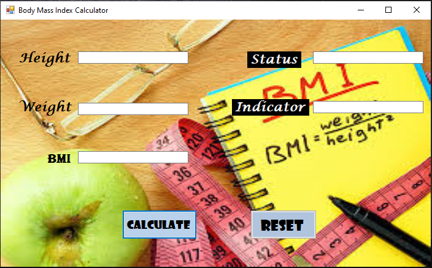

# 🧮 BMI Calculator (C#)

A simple and user-friendly **Body Mass Index (BMI) Calculator** built using **C#**. This application calculates BMI based on user input (weight and height) and categorizes the result according to standard BMI ranges.

---

## 📷 Screenshots

### 🏠 Main UI


---

## 🚀 Features

- ✅ Calculate BMI using metric or imperial units
- ✅ Categorizes results (Underweight, Normal, Overweight, Obese)
- ✅ Simple and clean UI
- ✅ Real-time validation for user inputs


## 🧱 Tech Stack

- **Language:** C#
- **Framework:** WinForms / WPF / Console App (update based on your project)
- **IDE:** Visual Studio


---

## 📌 How to Run

1. Clone the repository:
   ```bash
   git clone https://github.com/GayanHK-tech/BMI-Calculator.git
   ```
---

## ❤️ Contributions

- Pull requests are welcome. For major changes, please open an issue first to discuss what you would like to change.
